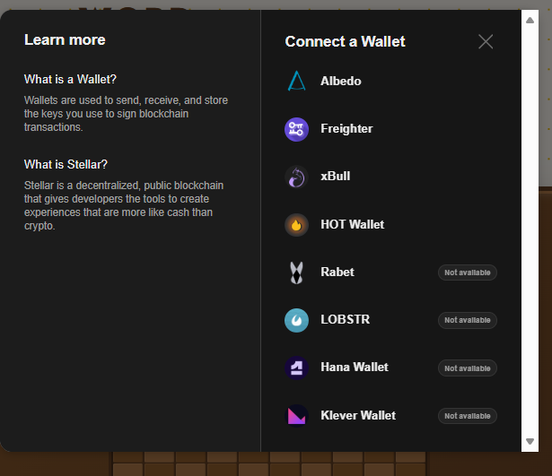
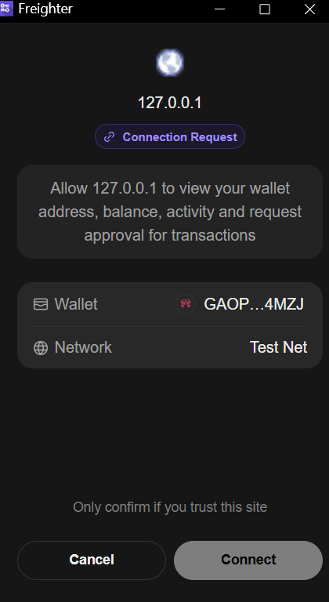
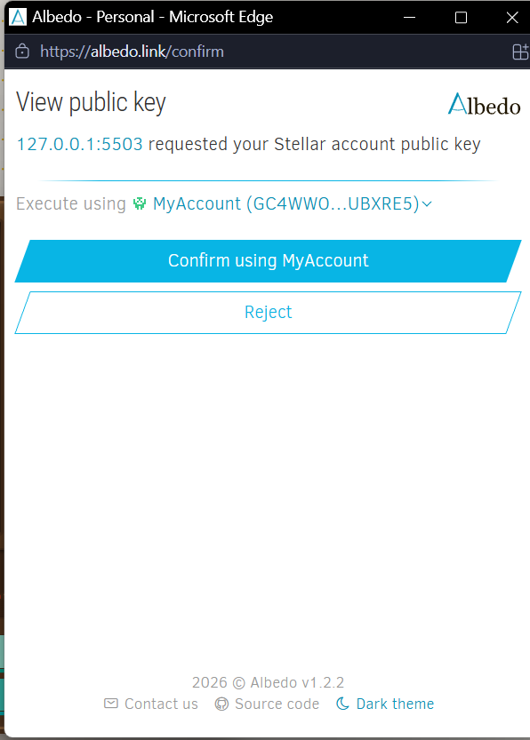
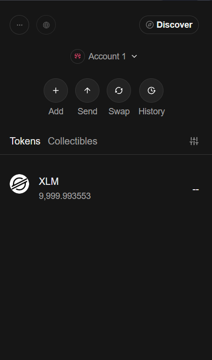
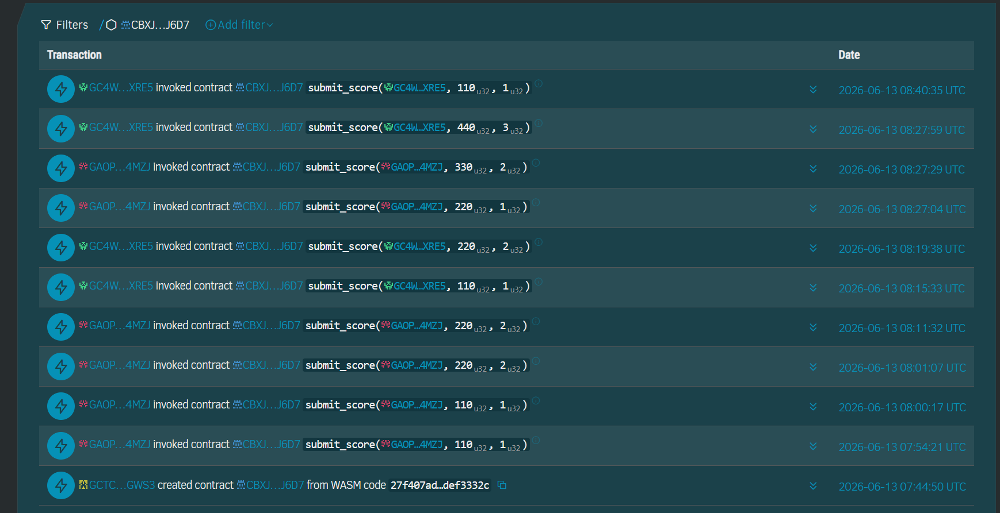
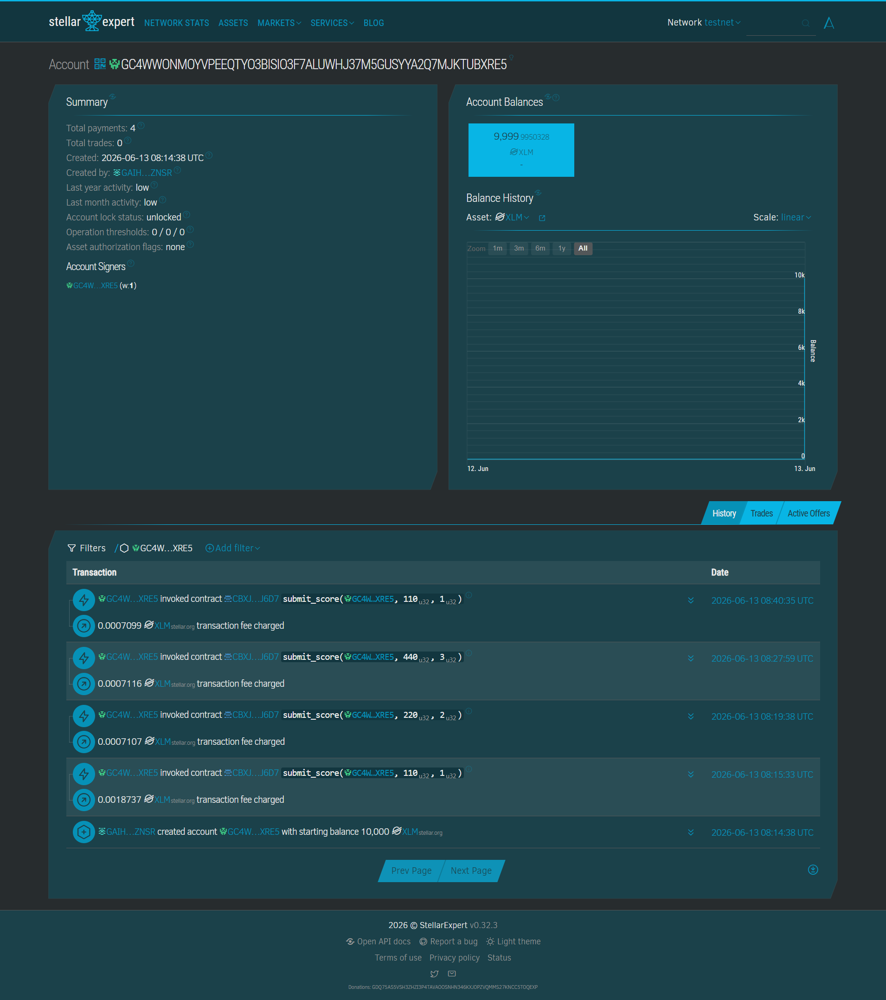

# 🎯 Word Scramble — On-Chain Leaderboard (Stellar)

A retro, mid-century-themed word puzzle game with an **on-chain leaderboard** and **badge reward system** powered by the **Stellar blockchain** and two communicating Soroban smart contracts. Players unscramble words to earn points, save scores on-chain, and earn achievement badges minted automatically via inter-contract calls.

**🔗 Live demo:** https://word-scramble-v1.surge.sh

**🎬 Demo video:** [Video/Word Scramble Video.mp4](Video/Word%20Scramble%20Video.mp4)

---

## 📖 Project Description

Word Scramble is a fully client-side browser game (no backend) that integrates Web3 wallet connectivity and smart-contract calls directly from the frontend:

- **Gameplay:** Drag-and-drop letter tiles to solve scrambled words across multiple categories (Science, History, Anime, Technology, and more), with progressive hints, win streaks, custom board themes, and synthesized retro audio.
- **Blockchain:** When you solve a word, your score is submitted to a Soroban smart contract on **Stellar Testnet**. The contract maintains a top-10 leaderboard, only updating an entry when you beat your previous best.
- **Inter-contract calls:** `submit_score` automatically calls the **RewardContract** to mint a badge (BRONZE / SILVER / GOLD / LEGEND) when a score milestone is hit — no extra transaction needed.
- **Event streaming:** The frontend polls `rpc.getEvents()` every 5 seconds. When any player submits a score, all connected tabs flash a **● LIVE** indicator in real time.
- **Multi-wallet:** Connect with any Stellar wallet (Freighter, Albedo, xBull, LOBSTR, Hana, and more) through Stellar Wallets Kit. The leaderboard shows which wallet each player used.
- **Auto-funding:** New Testnet accounts are automatically funded via Friendbot on connect, so anyone can play immediately.

---

## 🏗️ Smart Contracts

### WordScramble Contract
**Contract ID (Testnet):** `CBU2ZJVRKYZCUFGUCMHXEK7S4V6HK3ZP47WXJEXIP4VTUGLLRNJ2MIEE`

| Function | Description |
|---|---|
| `submit_score(player, score, level)` | Saves a score; only overwrites if higher. Emits a `score/saved` event and calls RewardContract to mint a badge. |
| `get_leaderboard()` | Returns the top-10 leaderboard (read-only) |
| `get_score(player)` | Returns a single player's best score |
| `set_reward_contract(reward_contract_id)` | Wires the RewardContract address for inter-contract calls |

### RewardContract
**Contract ID (Testnet):** `CDXIWPK4YYUTZPSXEBLELBBQIJ6X3UKJSDO4CJIH2KZXFWCBH6KXLIOQ`

| Function | Description |
|---|---|
| `init(word_contract_id)` | Authorises the WordScramble contract as the only caller allowed to mint badges |
| `mint_badge(player, badge)` | Mints a badge for the player (idempotent — same badge is never minted twice) |
| `get_badges(player)` | Returns all badges earned by a player |
| `has_badge(player, badge)` | Returns `true` if the player holds the given badge |

### Badge Tiers
| Badge | Score threshold |
|---|---|
| 🥉 BRONZE | 100+ |
| 🥈 SILVER | 300+ |
| 🥇 GOLD | 500+ |
| ⭐ LEGEND | 1000+ |

---

## 🛠️ Tech Stack

- **Frontend:** Vanilla HTML / CSS / JavaScript (no framework, no build step)
- **Blockchain SDK:** [`@stellar/stellar-sdk`](https://github.com/stellar/js-stellar-sdk) v15 (loaded via esm.sh CDN)
- **Wallets:** [`@creit.tech/stellar-wallets-kit`](https://github.com/Creit-Tech/Stellar-Wallets-Kit) (multi-wallet)
- **Smart contracts:** Soroban (Rust, `soroban-sdk` 26) — two contracts with inter-contract communication
- **CI/CD:** GitHub Actions — contract unit tests + frontend file check on every push
- **Network:** Stellar Testnet (Protocol 26)
- **Hosting:** Surge (static)

---

## 🚀 Setup — Run Locally

Because the app uses ES modules (`<script type="module">`), it **must be served over HTTP(S)** — opening `index.html` directly as a `file://` URL will not work.

### Prerequisites
- A Stellar wallet browser extension such as [Freighter](https://www.freighter.app/), **or** use the web-based [Albedo](https://albedo.link/) (no install needed)
- Set your wallet's network to **Testnet**
- Node.js 20+ (only if you want to use a Node-based local server)

### Steps

```bash
# 1. Clone the repo
git clone https://github.com/Jrabara101/word-scramble-stellar.git
cd word-scramble-stellar

# 2. Start any static server, e.g.:
npx serve .
#   or:  python -m http.server 8080
#   or:  VS Code "Live Server" extension

# 3. Open the served URL in your browser (e.g. http://localhost:3000)
```

### How to play + save a score
1. Click **Connect Wallet** and pick your wallet from the modal.
2. Your address, **XLM balance**, and any earned **badge** appear in the top bar.
3. Solve a scramble and click **Submit**.
4. Approve the transaction in your wallet.
5. You'll see **"Score saved on-chain!"** with the transaction hash.
6. If you hit a score milestone (100 / 300 / 500 / 1000), a badge is automatically minted via the RewardContract.

> **Smart contract development** (optional): contracts live in `word-scramble-contract/`. Build and deploy with the [Stellar CLI](https://developers.stellar.org/docs/tools/cli):
> ```bash
> cd word-scramble-contract
> stellar contract build
> stellar contract deploy --wasm target/wasm32v1-none/release/hello_world.wasm --network testnet --source <your-key>
> stellar contract deploy --wasm target/wasm32v1-none/release/reward_contract.wasm --network testnet --source <your-key>
> ```
> Then update `contractId` and `rewardContractId` in `stellar.js`.

---

## 🎬 Demo Video

A full walkthrough of the app end to end — wallet connection, solving a word, on-chain score submission, inter-contract badge minting, real-time event streaming across two tabs, leaderboard with wallet type badges, and CI/CD pipeline passing on GitHub Actions.

📁 **File:** [Video/Word Scramble Video.mp4](Video/Word%20Scramble%20Video.mp4)

> **What the video covers:**
> 1. Opening the live URL at `word-scramble-v1.surge.sh`
> 2. Multi-wallet connect modal (Stellar Wallets Kit)
> 3. Solving a word → Submit → Freighter approval → "Score saved on-chain!"
> 4. Tab 2 live event stream flash (● LIVE indicator via `rpc.getEvents`)
> 5. Leaderboard showing scores, badges, and wallet type per player
> 6. GitHub Actions CI — contract tests + frontend check passing

---

## 📸 Screenshots

### 1. Wallet Connected (Multi-Wallet)
The multi-wallet picker (Stellar Wallets Kit) lets players choose any supported wallet, then authorize the app. Works with both browser-extension wallets (Freighter) and web wallets (Albedo):





### 2. Balance Displayed
The connected wallet's XLM balance, and the same balances verified on Stellar Expert (Testnet):




### 3. Successful Testnet Transaction
`submit_score` transactions confirmed on Testnet (with fees charged), viewed on Stellar Expert:

**Verified transaction hash (Testnet):** `04fe1fd8a82ef7a7237ccd5a2079ea66898dfc0f4adaf80bd13a7ef6dde5815f`
[View on Stellar Expert](https://stellar.expert/explorer/testnet/tx/04fe1fd8a82ef7a7237ccd5a2079ea66898dfc0f4adaf80bd13a7ef6dde5815f)

> `submit_score(GAOPKW...3K4MZJ, 550, 5)` — Status: Successful — Ledger 3129587 — 2026-06-17 01:48:57 UTC




### 4. Transaction Result Shown to the User
The on-chain result — the contract's invocation history and the player's account activity on Stellar Expert:




### 5. Inter-Contract Communication (Badge Minting)
`submit_score` on WordScramble automatically calls `mint_badge` on RewardContract in the same transaction. Visible on Stellar Expert as a nested contract invocation:


---

## ⚙️ CI/CD Pipeline

GitHub Actions runs on every push to `main`:

1. **Soroban Contract Tests** — builds both contracts targeting `wasm32v1-none` and runs all unit tests with `cargo test`
2. **Frontend File Check** — verifies `index.html`, `style.css`, `script.js`, and `stellar.js` are present

[](https://github.com/Jrabara101/word-scramble-stellar/actions/workflows/ci.yml)

---

## 📂 Project Structure

```
.
├── index.html                          # Game markup + wallet bar
├── style.css                           # Mid-century styling, themes, responsive
├── script.js                           # Game logic (tiles, scoring, leaderboard UI)
├── stellar.js                          # Wallet connection + Soroban calls + event stream
├── word-scramble-contract/
│   ├── contracts/
│   │   ├── hello-world/src/lib.rs      # WordScramble contract (leaderboard + events)
│   │   └── reward-contract/src/lib.rs  # RewardContract (badge minting)
│   └── Cargo.toml
├── .github/workflows/ci.yml            # CI/CD pipeline
└── screenshots/                        # Submission screenshots
```

---

## 📜 License

MIT
