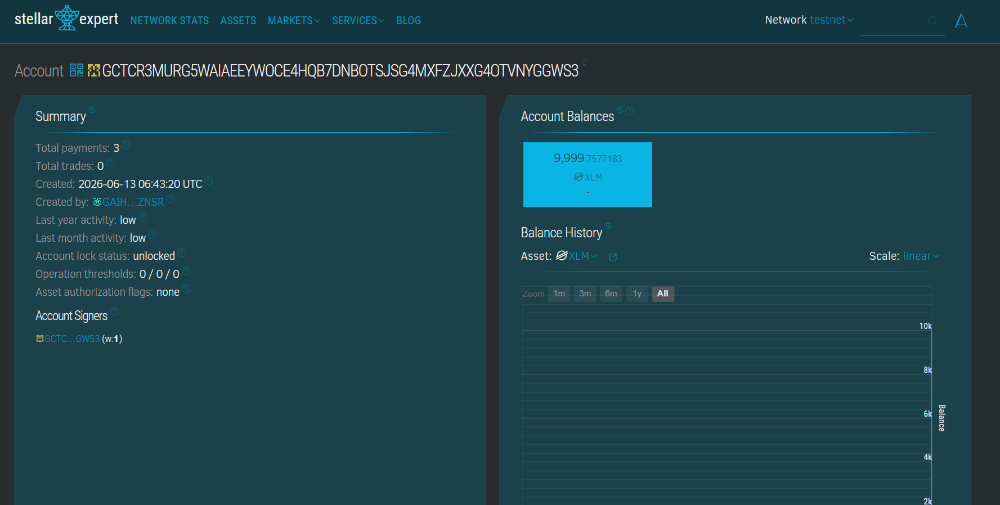
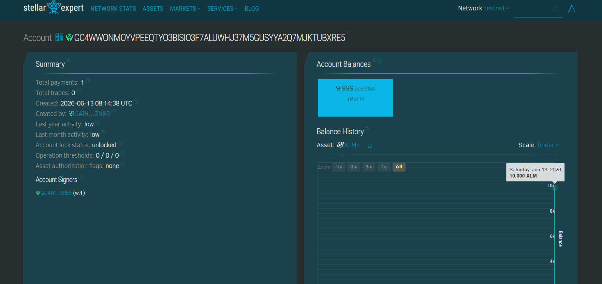
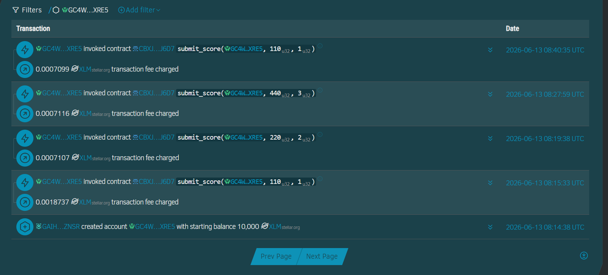
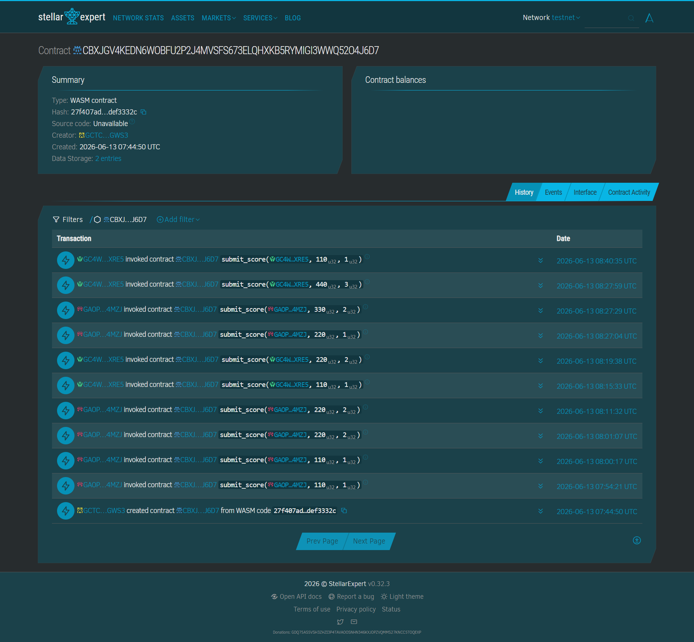

# 🎯 Word Scramble — On-Chain Leaderboard (Stellar)

A retro, mid-century-themed word puzzle game with an **on-chain leaderboard** powered by the **Stellar blockchain** and a **Soroban smart contract**. Players unscramble words to earn points, then save their high scores on-chain by signing a transaction with their Stellar wallet.

**🔗 Live demo:** https://word-scramble-v1.surge.sh

---

## 📖 Project Description

Word Scramble is a fully client-side browser game (no backend) that integrates Web3 wallet connectivity and smart-contract calls directly from the frontend:

- **Gameplay:** Drag-and-drop letter tiles to solve scrambled words across multiple categories (Science, History, Anime, Technology, and more), with progressive hints, win streaks, custom board themes, and synthesized retro audio.
- **Blockchain:** When you solve a word, your score is submitted to a Soroban smart contract on **Stellar Testnet**. The contract maintains a top-10 leaderboard, only updating an entry when you beat your previous best.
- **Multi-wallet:** Connect with any Stellar wallet (Freighter, Albedo, xBull, LOBSTR, Hana, Ledger, and more) through Stellar Wallets Kit.
- **Auto-funding:** New Testnet accounts are automatically funded via Friendbot on connect, so anyone can play immediately.

### Smart Contract

The Soroban contract (`word-scramble-contract/`) exposes:

| Function | Description |
|---|---|
| `submit_score(player, score, level)` | Saves a score (requires the player's signature; only overwrites if higher) |
| `get_leaderboard()` | Returns the top-10 leaderboard (read-only) |
| `get_score(player)` | Returns a single player's best score |

**Deployed contract ID (Testnet):** `CBXJGV4KEDN6WOBFU2P2J4MVSFS673ELQHXKB5RYMIGI3WWQ52O4J6D7`

---

## 🛠️ Tech Stack

- **Frontend:** Vanilla HTML / CSS / JavaScript (no framework, no build step)
- **Blockchain SDK:** [`@stellar/stellar-sdk`](https://github.com/stellar/js-stellar-sdk) v15 (loaded via esm.sh CDN)
- **Wallets:** [`@creit.tech/stellar-wallets-kit`](https://github.com/Creit-Tech/Stellar-Wallets-Kit) (multi-wallet)
- **Smart contract:** Soroban (Rust, `soroban-sdk` 26)
- **Network:** Stellar Testnet (Protocol 26)
- **Hosting:** Surge (static)

---

## 🚀 Setup — Run Locally

Because the app uses ES modules (`<script type="module">`), it **must be served over HTTP(S)** — opening `index.html` directly as a `file://` URL will not work.

### Prerequisites
- A Stellar wallet browser extension such as [Freighter](https://www.freighter.app/), **or** use the web-based [Albedo](https://albedo.link/) (no install needed)
- Set your wallet's network to **Testnet**
- Node.js 20+ (only if you want to use a Node-based local server)

### Steps

```bash
# 1. Clone the repo
git clone https://github.com/<your-username>/<your-repo>.git
cd <your-repo>

# 2. Start any static server, e.g.:
npx serve .
#   or:  python -m http.server 8080
#   or:  VS Code "Live Server" extension

# 3. Open the served URL in your browser (e.g. http://localhost:3000)
```

### How to play + save a score
1. Click **Connect Wallet** and pick your wallet from the modal.
2. Your address and **XLM balance** appear in the top bar (new accounts are auto-funded on Testnet).
3. Solve a scramble and click **Submit**.
4. Approve the transaction in your wallet.
5. You'll see **"Score saved on-chain!"** with the transaction hash.

> **Smart contract development** (optional): the contract lives in `word-scramble-contract/`. Build and deploy with the [Stellar CLI](https://developers.stellar.org/docs/tools/cli):
> ```bash
> cd word-scramble-contract
> stellar contract build
> stellar contract deploy --wasm target/wasm32-unknown-unknown/release/*.wasm --network testnet --source <your-key>
> ```
> Then update `contractId` in `stellar.js`.

---

## 📸 Screenshots

### 1. Wallet Connected


### 2. Balance Displayed
Wallet XLM balances verified on Stellar Expert (Testnet):




### 3. Successful Testnet Transaction


### 4. Transaction Result Shown to the User


---

## 📂 Project Structure

```
.
├── index.html              # Game markup + wallet bar
├── style.css               # Mid-century styling, themes
├── script.js               # Game logic (tiles, scoring, streaks)
├── stellar.js              # Wallet connection + Soroban calls + balance
├── word-scramble-contract/ # Soroban smart contract (Rust)
└── screenshots/            # Submission screenshots
```

---

## 📜 License

MIT
