# 🎯 Word Scramble — On-Chain Leaderboard (Stellar)

A retro, mid-century-themed word puzzle game with an **on-chain leaderboard** and **badge reward system** powered by the **Stellar blockchain** and two communicating Soroban smart contracts. Players unscramble words to earn points, save scores on-chain, and earn achievement badges minted automatically via inter-contract calls.

**🔗 Live demo:** https://word-scramble-v1.surge.sh

**🎬 Demo video (Level 3):** [Video/Word Scramble Video.mp4](Video/Word%20Scramble%20Video.mp4)

**🎬 Demo video (Level 4 additions):** [Watch on Google Drive](https://drive.google.com/file/d/1x4F4o2Dro7le2TTLAXYFpeGHs1OeX42e/view?usp=sharing)

**📄 Level 4 Idea Submission:** 
- **Word Document:** [IDEA_2_SUBMISSION.docx](Idea%20Submissions/IDEA_2_SUBMISSION.docx) ⬅️ **Download this for submission**
- Markdown: [IDEA_2_SUBMISSION.md](Idea%20Submissions/IDEA_2_SUBMISSION.md)
- HTML: [IDEA_2_SUBMISSION.html](Idea%20Submissions/IDEA_2_SUBMISSION.html)

---

## 🔌 Frontend ↔ Smart Contract Integration

**Integration file:** [`stellar.js`](stellar.js) (575 lines) — this is the file that connects the browser UI to the Soroban contracts. It is committed at the repo root and has been present since the very first commit ([`8f324d5`](https://github.com/Jrabara101/Stellar-Paradigm/commit/8f324d5)).

| Requirement | Where it's implemented in `stellar.js` |
|---|---|
| **Wallet connection** | [`StellarWallet.connect()`](stellar.js#L76-L121) opens the Stellar Wallets Kit modal, retrieves the selected wallet's address via `kit.getAddress()`, and stores the session (supports Freighter, xBull, Albedo, LOBSTR, Hana, and more) |
| **Contract initialization** | [`new sdk.Contract(STELLAR_CONFIG.contractId)`](stellar.js#L145) and [`new sdk.Contract(STELLAR_CONFIG.rewardContractId)`](stellar.js#L333) instantiate the two deployed Soroban contracts using the SDK loaded in [`_getSDK()`](stellar.js#L55-L60) |
| **Transaction building** | [`submitScore()`](stellar.js#L133-L209) builds a transaction with `TransactionBuilder` → `simulateTransaction` → `assembleTransaction` → wallet `signTransaction` → `sendTransaction`, then polls `getTransaction` for confirmation. The same pattern repeats in [`resetScore()`](stellar.js#L354-L415) and [`resetLeaderboard()`](stellar.js#L418-L478) |
| **Function matching** | Every `contract.call(...)` name matches an exported `pub fn` in the Rust contracts: `submit_score`, `get_leaderboard`, `get_score`, `reset_score`, `reset_leaderboard` in [`word-scramble-contract/contracts/leaderboard-contract/src/lib.rs`](word-scramble-contract/contracts/leaderboard-contract/src/lib.rs), and `get_badges` in the RewardContract. This is enforced automatically in CI — see [`check-contract-calls.js`](.github/scripts/check-contract-calls.js) |

CI also enforces that `stellar.js` exists on every push — see [`.github/workflows/ci.yml`](.github/workflows/ci.yml) and the "Frontend File Check" step referenced in the [CI/CD Pipeline](#️-cicd-pipeline) section below.

---

## 📖 Project Description

Word Scramble is a fully client-side browser game (no backend) that integrates Web3 wallet connectivity and smart-contract calls directly from the frontend:

- **Gameplay:** Drag-and-drop letter tiles to solve scrambled words across multiple categories (Science, History, Anime, Technology, and more), with progressive hints, win streaks, custom board themes, and synthesized retro audio.
- **Blockchain:** When you solve a word, your score is submitted to a Soroban smart contract on **Stellar Testnet**. The contract maintains a top-100 leaderboard, only updating an entry when you beat your previous best.
- **Inter-contract calls:** `submit_score` automatically calls the **RewardContract** to mint a badge (BRONZE / SILVER / GOLD / LEGEND) when a score milestone is hit — no extra transaction needed.
- **Event streaming:** The frontend polls `rpc.getEvents()` every 5 seconds. When any player submits a score, all connected tabs flash a **● LIVE** indicator in real time.
- **Multi-wallet:** Connect with any Stellar wallet (Freighter, Albedo, xBull, LOBSTR, Hana, and more) through Stellar Wallets Kit. The leaderboard shows which wallet each player used.
- **Auto-funding:** New Testnet accounts are automatically funded via Friendbot on connect, so anyone can play immediately.

---

## 🏗️ Smart Contracts

> 🔒 **Security review:** see [SECURITY.md](SECURITY.md) for the contracts' authorization model, two access-control gaps found and fixed before mainnet deploy, and the fee-sponsorship worker's trust model.

### WordScramble Contract
**Contract ID (Testnet):** `CDTTHP4T5IUDCG2MWJJZXOF5LUHXWMHN54E4PKKRQ56FSEQHSTIILWH3`

> Redeployed 2026-07-23 to raise the leaderboard cap from 10 → 100 entries ahead of scaling past 50 testnet users. The 12 real scores live on the prior contract (`CD2XXLJBFBVYAGJYUHQR4XH6ZYWQUMR6A22TUFY4R2S3VU2NCY7KPJEG`) at redeploy time were carried forward via a one-time admin-authenticated migration — see `admin_seed_score` below.

| Function | Description |
|---|---|
| `submit_score(player, score, level)` | Saves a score; only overwrites if higher. Emits a `score/saved` event and calls RewardContract to mint a badge. |
| `get_leaderboard()` | Returns the top-100 leaderboard (read-only) |
| `get_score(player)` | Returns a single player's best score |
| `set_reward_contract(reward_contract_id)` | Wires the RewardContract address for inter-contract calls |
| `admin_seed_score(admin, player, score, level)` | Admin-only: writes a score without player auth. Used once during the 2026-07-23 migration to carry forward scores already proven on the prior contract; not used in normal gameplay. |

### RewardContract
**Contract ID (Testnet):** `CDXIWPK4YYUTZPSXEBLELBBQIJ6X3UKJSDO4CJIH2KZXFWCBH6KXLIOQ`

| Function | Description |
|---|---|
| `init(word_contract_id)` | Authorises the WordScramble contract as the only caller allowed to mint badges |
| `mint_badge(player, badge)` | Mints a badge for the player (idempotent — same badge is never minted twice) |
| `get_badges(player)` | Returns all badges earned by a player |
| `has_badge(player, badge)` | Returns `true` if the player holds the given badge |

### Badge Tiers
| Badge | Score threshold |
|---|---|
| 🥉 BRONZE | 100+ |
| 🥈 SILVER | 300+ |
| 🥇 GOLD | 500+ |
| ⭐ LEGEND | 1000+ |

---

## 🛠️ Tech Stack

- **Frontend:** Vanilla HTML / CSS / JavaScript (no framework, no build step)
- **Blockchain SDK:** [`@stellar/stellar-sdk`](https://github.com/stellar/js-stellar-sdk) v15 (loaded via esm.sh CDN)
- **Wallets:** [`@creit.tech/stellar-wallets-kit`](https://github.com/Creit-Tech/Stellar-Wallets-Kit) (multi-wallet)
- **Smart contracts:** Soroban (Rust, `soroban-sdk` 26) — two contracts with inter-contract communication
- **CI/CD:** GitHub Actions — CI runs contract unit tests + frontend build/validate on every push; CD deploys the frontend to surge.sh and packages the contract wasm after CI passes on `main`
- **Network:** Stellar Testnet (Protocol 26)
- **Hosting:** Surge (static)

---

## 🚀 Setup — Run Locally

Because the app uses ES modules (`<script type="module">`), it **must be served over HTTP(S)** — opening `index.html` directly as a `file://` URL will not work.

### Prerequisites
- A Stellar wallet browser extension such as [Freighter](https://www.freighter.app/), **or** use the web-based [Albedo](https://albedo.link/) (no install needed)
- Set your wallet's network to **Testnet**
- Node.js 20+ (only if you want to use a Node-based local server)

### Steps

```bash
# 1. Clone the repo
git clone https://github.com/Jrabara101/Stellar-Paradigm.git
cd Stellar-Paradigm

# 2. Start any static server, e.g.:
npx serve .
#   or:  python -m http.server 8080
#   or:  VS Code "Live Server" extension

# 3. Open the served URL in your browser (e.g. http://localhost:3000)
```

### How to play + save a score
1. Click **Connect Wallet** and pick your wallet from the modal.
2. Your address, **XLM balance**, and any earned **badge** appear in the top bar.
3. Solve a scramble and click **Submit**.
4. Approve the transaction in your wallet.
5. You'll see **"Score saved on-chain!"** with the transaction hash.
6. If you hit a score milestone (100 / 300 / 500 / 1000), a badge is automatically minted via the RewardContract.

> **Smart contract development** (optional): contracts live in `word-scramble-contract/`. Build and deploy with the [Stellar CLI](https://developers.stellar.org/docs/tools/cli):
> ```bash
> cd word-scramble-contract
> stellar contract build
> stellar contract deploy --wasm target/wasm32v1-none/release/leaderboard_contract.wasm --network testnet --source <your-key>
> stellar contract deploy --wasm target/wasm32v1-none/release/reward_contract.wasm --network testnet --source <your-key>
> ```
> Then update `contractId` and `rewardContractId` in `stellar.js`.

---

## 🎤 Product Presentation (Pitch Deck)

A 9-slide pitch deck covering all six required sections — **Problem, Solution, Market Opportunity, Architecture, Growth Strategy, and Future Roadmap** — plus a Demo & Traction slide backed by the verified on-chain numbers.

- **📊 Deck (PowerPoint):** [`Pitch Deck/Word_Scramble_Pitch_Deck.pptx`](Pitch%20Deck/Word_Scramble_Pitch_Deck.pptx) — the presentation file. Word-for-word narration is embedded in each slide's **speaker notes**, so you can present straight from it.
- **📄 Deck (PDF):** [`Pitch Deck/Word_Scramble_Pitch_Deck.pdf`](Pitch%20Deck/Word_Scramble_Pitch_Deck.pdf) — view without PowerPoint. The traction slide's growth chart is built from the real on-chain data, not placeholder figures.
- **📝 Speaker script:** [`Pitch Deck/PITCH_DECK_SCRIPT.md`](Pitch%20Deck/PITCH_DECK_SCRIPT.md) — the same per-slide narration with timing cues (~5 min run).

> The deck's numbers match the on-chain reality documented in [`WALLET_VERIFICATION.md`](WALLET_VERIFICATION.md): 51 distinct verified users, 182 verified transactions, 100% verified, 4.8/5 average rating.

---

## 🎬 Demo Video

### Level 5 — Full Product Walkthrough

📁 **File:** [Video/Word Scramble Full Walkthrough.mp4](Video/Word%20Scramble%20Full%20Walkthrough.mp4) (~9 min)

An end-to-end walkthrough: game/UI tour → first-time onboarding & wallet guide → connecting a wallet (auto-funded) & winning a round on-chain → Daily Challenge with a real wallet-signed transaction → the new **Scramble Board v2.0.0** mode → on-chain proof on Stellar Expert → live GoatCounter analytics → the user feedback loop (Google Form → Excel) → the 51-user `WALLET_VERIFICATION.md` proof.

📝 **Per-clip narration script:** [`DEMO_CLIP_SCRIPTS.md`](DEMO_CLIP_SCRIPTS.md) — what's on screen and the voiceover for each of the 9 source clips this walkthrough was cut from.

### Level 3 — Core Gameplay & Blockchain Integration

A full walkthrough of the app end to end — wallet connection, solving a word, on-chain score submission, inter-contract badge minting, real-time event streaming across two tabs, leaderboard with wallet type badges, and CI/CD pipeline passing on GitHub Actions.

📁 **File:** [Video/Word Scramble Video.mp4](Video/Word%20Scramble%20Video.mp4)

> **What the video covers:**
> 1. Opening the live URL at `word-scramble-v1.surge.sh`
> 2. Multi-wallet connect modal (Stellar Wallets Kit)
> 3. Solving a word → Submit → Freighter approval → "Score saved on-chain!"
> 4. Tab 2 live event stream flash (● LIVE indicator via `rpc.getEvents`)
> 5. Leaderboard showing scores, badges, and wallet type per player
> 6. GitHub Actions CI — contract tests + frontend check passing

### Level 4 — User Onboarding, Analytics & Verification

Covers everything added for Level 4 — features not shown in the Level 3 video above.

🔗 **Watch:** [Google Drive](https://drive.google.com/file/d/1x4F4o2Dro7le2TTLAXYFpeGHs1OeX42e/view?usp=sharing)

> **What the video covers:**
> 1. Intro to what's new since Level 3
> 2. First-time wallet guide — a 5-slide walkthrough explaining wallets, installing Freighter, connecting, and on-chain submission for players new to crypto
> 3. Connecting a wallet (auto-funded testnet account) and playing through several rounds
> 4. A full solve → hint → Submit → Freighter approval → "Spectacular!" victory cycle, saved on-chain
> 5. The in-app feedback survey — name, wallet address, rating, and open feedback — submitted live
> 6. The GoatCounter analytics dashboard — live wallet connect, feedback, and score-submission events
> 7. [`WALLET_VERIFICATION.md`](WALLET_VERIFICATION.md) on GitHub — every tester's wallet cross-checked against real on-chain transactions (the doc now lists **51 verified users**)
> 8. Closing — live URL, public repo, and CI passing

---

## 📸 Screenshots

### 1. Wallet Connected (Multi-Wallet)
The multi-wallet picker (Stellar Wallets Kit) lets players choose any supported wallet, then authorize the app. Works with both browser-extension wallets (Freighter) and web wallets (Albedo):

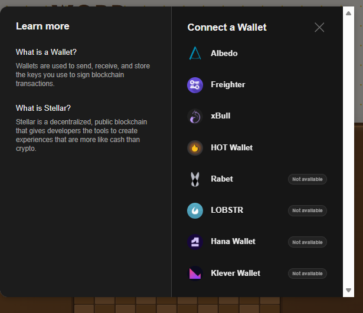
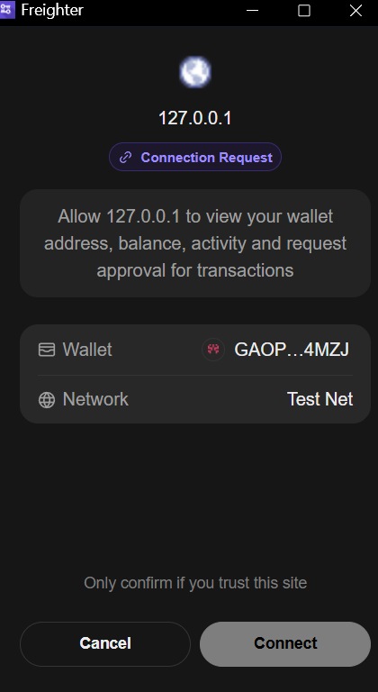
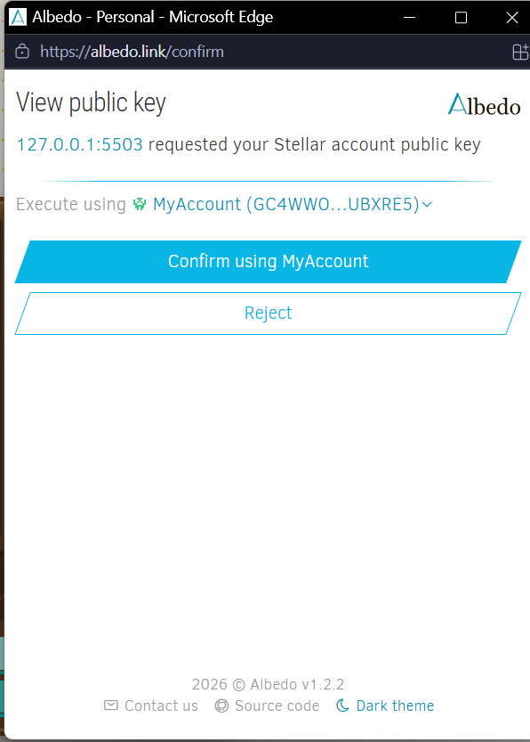

### 2. Balance Displayed
The connected wallet's XLM balance, and the same balances verified on Stellar Expert (Testnet):

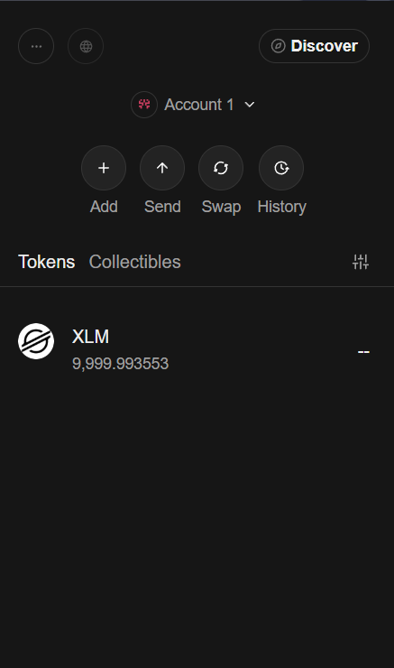
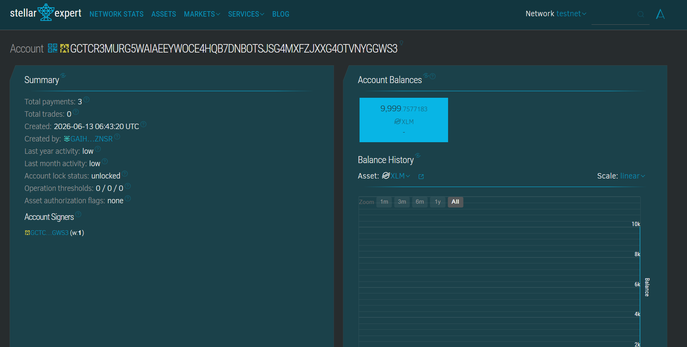
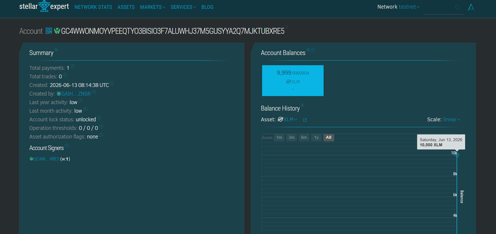

### 3. Successful Testnet Transaction
`submit_score` transactions confirmed on Testnet (with fees charged), viewed on Stellar Expert:

**Verified transaction hash (Testnet):** `04fe1fd8a82ef7a7237ccd5a2079ea66898dfc0f4adaf80bd13a7ef6dde5815f`
[View on Stellar Expert](https://stellar.expert/explorer/testnet/tx/04fe1fd8a82ef7a7237ccd5a2079ea66898dfc0f4adaf80bd13a7ef6dde5815f)

> `submit_score(GAOPKW...3K4MZJ, 550, 5)` — Status: Successful — Ledger 3129587 — 2026-06-17 01:48:57 UTC

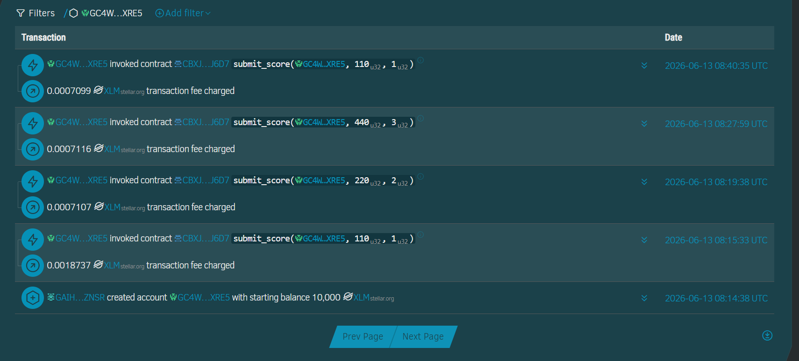
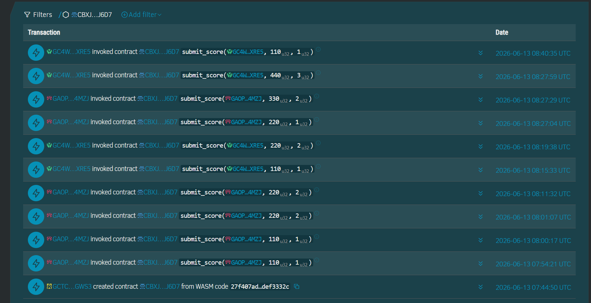

### 4. Transaction Result Shown to the User
The on-chain result — the contract's invocation history and the player's account activity on Stellar Expert:

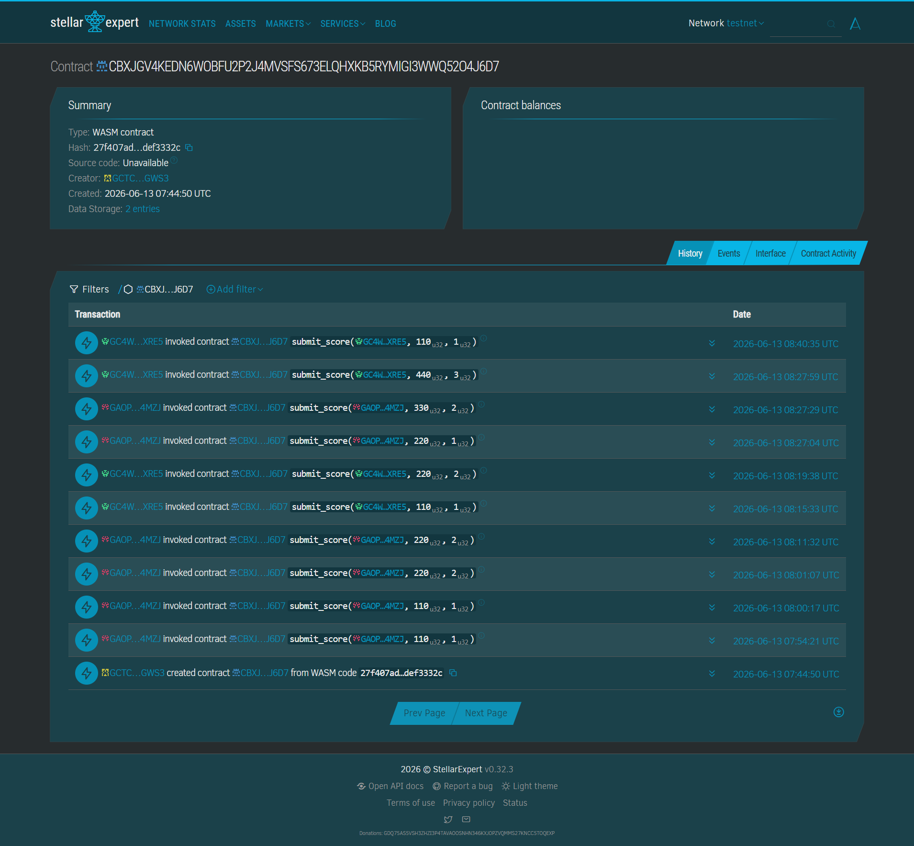
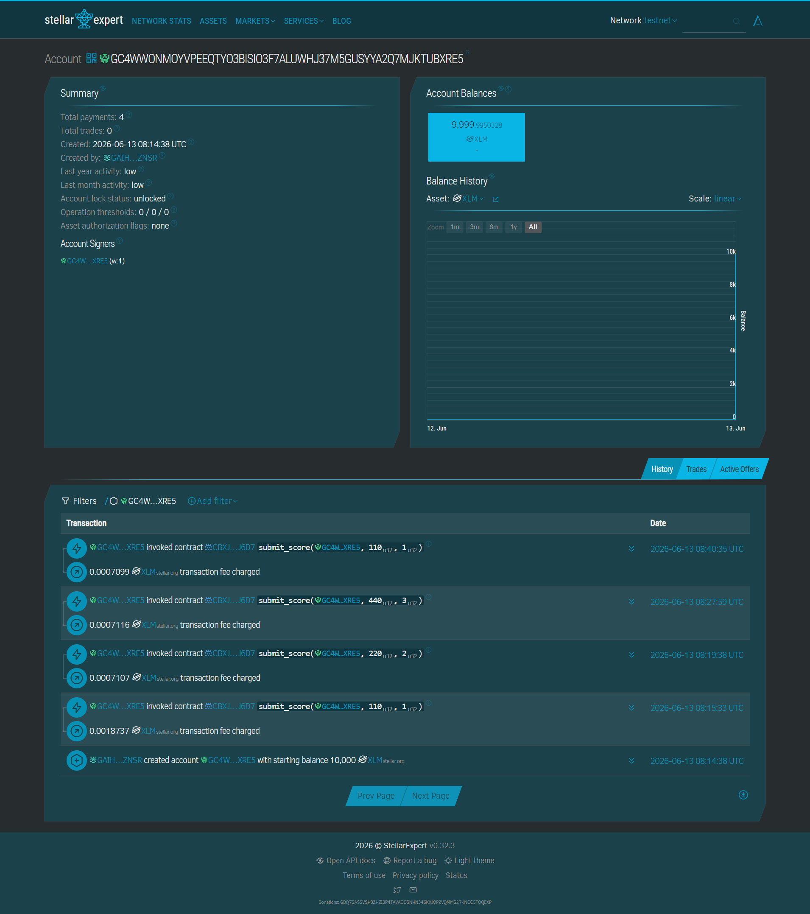

### 5. Inter-Contract Communication (Badge Minting)
`submit_score` on WordScramble automatically calls `mint_badge` on RewardContract in the same transaction. Visible on Stellar Expert as a nested contract invocation:


### 6. Mobile Responsive Design
The full game — board, wallet bar, hints, and modals — tested across four real device viewports:


### 7. Analytics / Monitoring Setup
Live [GoatCounter](https://word-scramble-stellar.goatcounter.com) dashboard showing real custom events (`wallet_connect`, `score_submitted`, `feedback_opened`, `error_wallet_connect`) from real testers, not synthetic traffic:

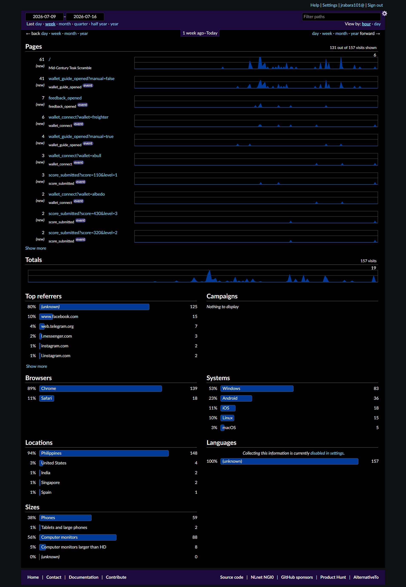

---

## ⚙️ CI/CD Pipeline

**CI** (`.github/workflows/ci.yml`) runs automatically on every push to `main`:

1. **Soroban Contract Tests** — builds both contracts targeting `wasm32v1-none` and runs all unit tests with `cargo test`
2. **Frontend Build & Validate** — verifies `index.html`, `style.css`, `script.js`, `stellar.js`, `feedback.js`, and `wallet-guide.js` are present, syntax-checks every JS file with `node --check`, and cross-checks that every `contract.call(...)` in `stellar.js` matches a real `pub fn` on one of the two contracts ([`check-contract-calls.js`](.github/scripts/check-contract-calls.js))
3. **Fee-Sponsorship Worker Validate** *(added for Level 6)* — syntax-checks `sponsor-worker/src/index.mjs`, fails the build if a Stellar secret key (`S…`) is ever committed under `sponsor-worker/`, asserts the fee-bump validation guards (`assertFeeBumpEligible` and its four rejection paths) are still present so the sponsor can never be tricked into paying for arbitrary transactions, and asserts `STARTING_BALANCE_STROOPS` stays above zero — a `0` balance is protocol-valid but wallets pre-check fee affordability before signing and would silently block every new sponsored player
4. **Mainnet Config Guard** *(added for Level 6)* — asserts every mainnet field in `stellar.js` (`rpcUrl`, `contractId`, `rewardContractId`, `credentialContractId`, `sponsorWorkerUrl`) is populated. A `null` here once caused the live site to serve a stale pre-mainnet config; this makes that failure loud instead of silent

**CD** (`.github/workflows/cd.yml`) runs after CI succeeds on `main`:

1. **Deploy Frontend (surge.sh)** — publishes the static site to the live demo URL
2. **Build & Package Smart Contract** — builds the release wasm and uploads it as a versioned build artifact (no automatic live contract redeploy, to avoid contract-ID drift)

[](https://github.com/Jrabara101/Stellar-Paradigm/actions/workflows/ci.yml)
[](https://github.com/Jrabara101/Stellar-Paradigm/actions/workflows/cd.yml)

**23 workflow runs — all passing ✅ since Run #2 | 1 fixed early failure (wasm32 target, resolved in Run #2)**

Recent runs, newest first:

| Commit | Result |
|---|---|
| Fix broken IDEA_2_SUBMISSION links after Idea Submissions/ move | ✅ 2m 14s |
| Add Level 4 demo video link to README | ✅ 2m 10s |
| Midnight Update | ✅ 1m 58s |
| Add Level 4 verification docs, fix stale contract ID, gameplay polish | ✅ 1m 58s |
| Feedback Form | ✅ 1m 59s |
| Daily Challenge | ✅ 1m 59s |
| Added files | ✅ 1m 59s |
| ... 16 earlier runs, all passing ... | ✅ |
| Add CI/CD pipeline and 5 contract unit tests | ❌ Fixed in next run |

🔗 [View all workflow runs](https://github.com/Jrabara101/Stellar-Paradigm/actions)

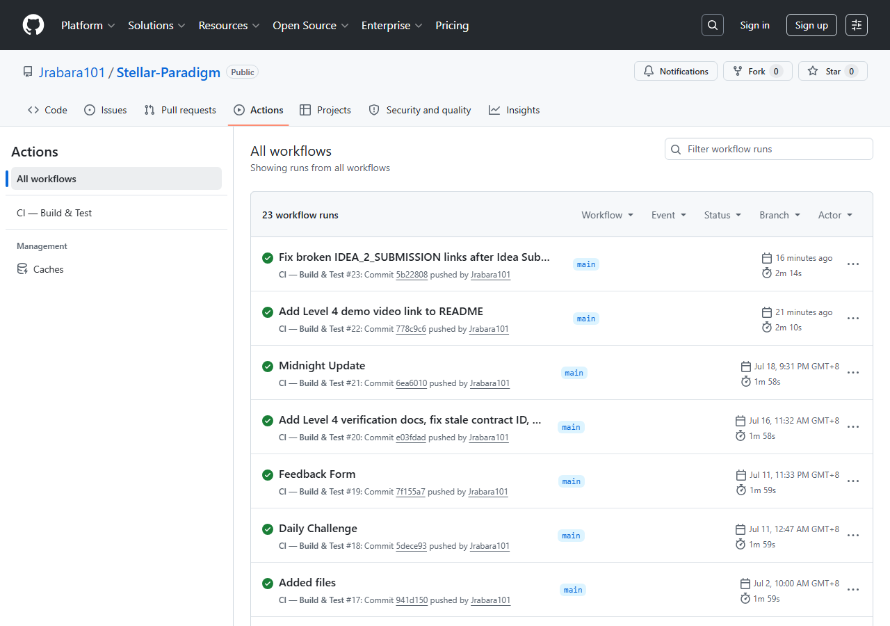

---

## 📊 Analytics, Monitoring & User Feedback

Added for Level 4 — Product Quality and User Onboarding requirements.

**Analytics/monitoring:** [GoatCounter](https://www.goatcounter.com) (free, privacy-friendly, no cookie banner) is wired in via [`index.html`](index.html) and tracked from [`stellar.js`](stellar.js) through a shared `trackEvent()` helper (~line 12). It fires custom events for:
- `wallet_connect` — every successful wallet connection, tagged with wallet type
- `score_submitted` — every on-chain score save, tagged with score/level
- `error_wallet_connect` / `error_submit_score` — failures, tagged with the error message (doubles as lightweight error monitoring, no separate Sentry account needed)

**Live at:** [word-scramble-stellar.goatcounter.com](https://word-scramble-stellar.goatcounter.com) ✅

**Feedback collection:** [`feedback.js`](feedback.js) adds a persistent "Feedback" button (bottom-right) plus an auto-prompt shown ~2.5s after a player's first successful score submission, opening an embedded Google Form (Name, Wallet Address, rating, open feedback, and a retention question). Dismissal is remembered in `localStorage` so it never nags a returning player. Because the form also collects wallet address, its response sheet doubles as the "10+ wallet interactions" proof required for submission.

**Setup required:** copy the form's embed `src` URL and replace `FEEDBACK_FORM_URL` at the top of `feedback.js`.

**First-time wallet guide:** [`wallet-guide.js`](wallet-guide.js) adds a 5-slide carousel (using real screenshots from `screenshots/`) explaining what a wallet is, how to install Freighter, how to connect, and what happens when a score is submitted on-chain — aimed at players with no prior crypto experience. Reachable anytime via the "❓ Guide" button in the wallet bar, and auto-shown once to first-time visitors. It deliberately waits for the game's own first-visit "how to play" tutorial (`#onboarding-modal-backdrop` in `script.js`) to close first, so the two guides never stack on top of each other.

**Proof of 50+ real users:** [`WALLET_VERIFICATION.md`](WALLET_VERIFICATION.md) lists **51 distinct verified users** (from 52 form responses), each with their wallet address cross-checked directly against Stellar Horizon to confirm a real, successful `submit_score` transaction — not just self-reported form data. 100% of distinct wallets have genuine on-chain activity, across both contract deployments, totalling **182 verified transactions**.

**User feedback summary:** [`FEEDBACK_SUMMARY.md`](FEEDBACK_SUMMARY.md) synthesizes the qualitative themes. Across all 52 responses: **4.8/5 average rating**, and **51/52 would play again**.

**Full response export (Excel):** [`Updated 50 test net users.xlsx`](Updated%2050%20test%20net%20users.xlsx) — the raw Google Form export (name, Stellar wallet address, rating, feedback, would-play-again, and transaction-proof screenshot links) backing the verification above.

---

## 🔄 Feedback → Action: Next-Phase Improvement Plan

Real player feedback in [`FEEDBACK_SUMMARY.md`](FEEDBACK_SUMMARY.md) surfaced four concrete themes. Here's what's been done about each one, and what's next:

| Feedback theme | Who flagged it | Status | Where |
|---|---|---|---|
| "Word Hint" button confusing (the one respondent who wouldn't play again cited this) | Dayniel Talusig | ✅ Fixed — renamed to "Definition" to disambiguate from the paid "Hint" button, updated everywhere in the UI | [`c02cee9`](https://github.com/Jrabara101/Stellar-Paradigm/commit/c02cee9) |
| Not all words show a definition | Darid De Jesus | ✅ Partially addressed — the no-match fallback now names the category and word length instead of a generic stub; full curated-definition coverage for every offline word is still open | [`c02cee9`](https://github.com/Jrabara101/Stellar-Paradigm/commit/c02cee9) |
| Board resets each word instead of persisting like real Scrabble / wants a bigger board | Ricky Mark Mercado, Darid De Jesus | 🗺️ Roadmap — scoped as a 2-player **Scrabble Duel** mode (persistent board, new turn engine) before a full 4-player 15×15 board | Tracked internally, not yet built |
| Add more difficulty | Cedrick Cadence Cornejo | 🗺️ Roadmap — evaluated this cycle; word difficulty currently auto-scales with level rather than being player-selectable. A manual difficulty selector needs its own UI/state design rather than a rushed addition, so it's deferred to the next build pass instead of shipped half-finished | Not yet built |

---

## 📂 Project Structure

```
.
├── index.html                          # Game markup + wallet bar
├── style.css                           # Mid-century styling, themes, responsive
├── script.js                           # Game logic (tiles, scoring, leaderboard UI)
├── stellar.js                          # Wallet connection + Soroban calls + event stream
├── feedback.js                         # Feedback widget (Google Form modal + FAB)
├── wallet-guide.js                     # First-time wallet walkthrough (5-slide carousel)
├── word-scramble-contract/
│   ├── contracts/
│   │   ├── leaderboard-contract/src/lib.rs # WordScramble contract (leaderboard + events)
│   │   └── reward-contract/src/lib.rs  # RewardContract (badge minting)
│   └── Cargo.toml
├── .github/workflows/ci.yml            # CI: contract tests + frontend build/validate
├── .github/workflows/cd.yml            # CD: deploy frontend (surge.sh) + package contract wasm
└── screenshots/                        # Submission screenshots
```

---

## 🚀 Level 6 Submission Checklist — Mainnet Launch, Security & Real Adoption

*Status as of 2026-08-26. Items still open are marked honestly rather than claimed.*

### Mainnet Deployment
- [x] **Contracts live on Stellar Public Network** — all three deployed 2026-08-20:
  - Leaderboard — [`CA37MRPV…ZCQS`](https://stellar.expert/explorer/public/contract/CA37MRPVFGLRRENBW75CYZVBZPWZIS2FJQDMUFYU7MSLUNKFIDV2ZCQS)
  - Reward — [`CAPRQAUN…OLF3`](https://stellar.expert/explorer/public/contract/CAPRQAUNC3L54PX54ELLFHGOEIWE5GEOSOHEQ4IWBMKK6E73D32BOLF3)
  - Credential — [`CDK5KW5S…P4JN`](https://stellar.expert/explorer/public/contract/CDK5KW5SY2IHOBARDDFIQFTYWMECZA3RDC6NYDB3ZCWH72CKWHJJP4JN)
- [x] **Public production app** — [word-scramble-v1.surge.sh/?network=mainnet](https://word-scramble-v1.surge.sh/?network=mainnet)
- [x] **Deploy cost documented** — 30.49 XLM of real XLM, itemised per transaction

### Real Adoption
- [x] **22 distinct players with on-chain scores** — [`WALLET_VERIFICATION_MAINNET.md`](WALLET_VERIFICATION_MAINNET.md); **21 independent** of the developer after disclosing the author's own wallet, clearing the 20+ bar even after every deduction
- [x] **Real transaction activity** — **55 fee-bumped `submit_score` transactions**, every one verified against Horizon
- [x] **Roster with per-user on-chain evidence** — [`MAINNET_USERS_LEVEL6.csv`](MAINNET_USERS_LEVEL6.csv) · [Google Sheet](https://docs.google.com/spreadsheets/d/1W_9ug14yZ__HFro8doEryZ7rh1R9XNyw4BhGz9AHZtc/edit)
- [x] **Independently reproducible** — [verification commands](WALLET_VERIFICATION_MAINNET.md#reproducing-this-verification) let any reviewer re-derive every figure

### Security
- [x] **Security review** — [`SECURITY.md`](SECURITY.md): full `require_auth()` table across all three contracts
- [x] **Two access-control gaps found and fixed pre-launch** — `mint_badge` caller restriction; `set_reward_contract` admin gate
- [x] **Known limitations disclosed** — `init` front-running window and the `admin_seed_score` backdoor documented rather than hidden
- [x] **Sponsor key isolation** — the fee-sponsorship worker is a separate Cloudflare Worker from word-curation, and validates every inner transaction before co-signing

### Advanced ("Black Belt") Feature — Fee Sponsorship
- [x] **Gasless onboarding via CAP-33 + fee bump** — `sponsor-worker/`, live at `word-scramble-sponsor.jrabara101.workers.dev`
- [x] **20 of 22 players never held XLM** — sponsor created their accounts and paid every fee
- [x] **Total cost 1.43 XLM for 55 submissions** (~0.026 XLM each)

### Technical Standards
- [x] **30+ meaningful commits** — 73 on `main`
- [x] **Production setup** — GitHub Actions CI/CD, contract unit tests, automated surge.sh deploy
- [x] **Full documentation** — README, [`SECURITY.md`](SECURITY.md), [`WALLET_VERIFICATION_MAINNET.md`](WALLET_VERIFICATION_MAINNET.md), user guide

### User Onboarding
- [x] **Google Form collects wallet, name, rating, feedback** — [form](https://docs.google.com/forms/d/e/1FAIpQLSeHiCmcXKAWSnRyRMX7GbVMN4mMuhZukWUVFmX9pDBWbqPODA/viewform)
- [x] **Email field added** (2026-08-22)
- [x] **Mainnet roster exported** — [`MAINNET_USERS_LEVEL6.csv`](MAINNET_USERS_LEVEL6.csv)
- [ ] ⚠️ **Email addresses collected** — the email field postdates all 53 existing responses; a direct collection round is in progress
- [ ] ⚠️ **Form rows for all players** — Rico, Hessah, Peter and Jerry are verified on-chain but have not yet submitted the form

### Marketing & Ecosystem
- [x] **Twitter/X launch post** — published 2026-08-26 as a 3-post thread by [@JRABARA1](https://x.com/JRABARA1), announcing the mainnet launch and the gasless (CAP-33 + fee-bump) onboarding flow:
  - [Post 1 — mainnet launch announcement](https://x.com/JRABARA1/status/2092621617608405473)
  - [Post 2 — CAP-33 co-signing + wallet fee pre-check gotchas](https://x.com/JRABARA1/status/2092621791852376244)
  - [Post 3 — verified on-chain cost data](https://x.com/JRABARA1/status/2092622049089094068)
  - Draft and alternate single-post version: [`LAUNCH_POST_X.md`](LAUNCH_POST_X.md)
- [x] **Ecosystem contribution — technical blog post published 2026-08-28 on dev.to:** [*"Gasless Onboarding on Stellar: What CAP-33 and Fee Bumps Actually Cost"*](https://dev.to/johnrick_rabara_50eca3330/gasless-onboarding-on-stellar-what-cap-33-and-fee-bumps-actually-cost-53l4) — a build report covering the CAP-33 co-signing requirement for not-yet-existent accounts, the wallet fee pre-check that silently blocks 0-balance sponsored accounts, confirmation latency vs. genuinely dropped transactions, and real mainnet cost data (99.7% of a 30.49 XLM Soroban deploy is WASM upload). Source: [`BLOG_FEE_SPONSORSHIP.md`](BLOG_FEE_SPONSORSHIP.md)

### Submission Checklist
- [x] Public GitHub repository — [github.com/Jrabara101/Stellar-Paradigm](https://github.com/Jrabara101/Stellar-Paradigm)
- [x] 30+ meaningful commits — 73
- [x] Live mainnet app URL — [word-scramble-v1.surge.sh/?network=mainnet](https://word-scramble-v1.surge.sh/?network=mainnet)
- [x] Mainnet contract addresses — three, listed above
- [x] Proof of mainnet users — [`WALLET_VERIFICATION_MAINNET.md`](WALLET_VERIFICATION_MAINNET.md)
- [x] Transaction activity proof — 50 verified fee-bumped submissions
- [x] Security review proof — [`SECURITY.md`](SECURITY.md)
- [x] Technical documentation — this README + linked docs
- [x] User guide — in-app 5-slide wallet guide (`wallet-guide.js`)
- [x] Demo video — [`Video/Word Scramble Full Walkthrough.mp4`](Video/Word%20Scramble%20Full%20Walkthrough.mp4)
- [x] Twitter/X launch post link — [thread by @JRABARA1](https://x.com/JRABARA1/status/2092621617608405473) (3 posts, published 2026-08-26)
- [x] Community contribution link — [dev.to: *Gasless Onboarding on Stellar*](https://dev.to/johnrick_rabara_50eca3330/gasless-onboarding-on-stellar-what-cap-33-and-fee-bumps-actually-cost-53l4) (published 2026-08-28)

---

## ✅ Level 5 Submission Checklist

Mapped directly to the official Level 5 requirements — every item below links to its actual proof in this repo, not just a claim.

### User Growth
- [x] **50+ testnet users onboarded** — [`WALLET_VERIFICATION.md`](WALLET_VERIFICATION.md) documents **51 distinct verified users** (from 52 form responses)
- [x] **Real transaction activity** — all 51 wallets independently cross-checked against Stellar Horizon; **182 verified `submit_score` transactions**, 100% verification rate
- [x] **Active usage proof** — many wallets show 2–12 repeat submissions each (not one-and-done); live in [GoatCounter analytics](https://word-scramble-stellar.goatcounter.com)

### Product Improvements
- [x] **New features from user feedback** — see [Feedback → Action](#-feedback--action-next-phase-improvement-plan) below; headline feature: **Scramble Board v2.0.0** (2–4 player, 15×15 board), built because testers asked for a persistent Scrabble-style board
- [x] **UX/UI and stability improvements** — hint/definition naming fix, fallback-clue coverage, feedback-modal suppression bug — all commit-linked below
- [x] **Onboarding optimization** — 5-slide first-time wallet guide + auto-funding via Friendbot, audited this cycle for friction points

### Product Presentation
- [x] **Professional pitch deck** — [Pitch Deck section above](#-product-presentation-pitch-deck) (PPTX + PDF), all six required topics covered:
  - [x] Problem statement · [x] Solution · [x] Market opportunity · [x] Architecture · [x] Growth strategy · [x] Future roadmap

### Demo
- [x] **Full product walkthrough recorded** — [Video/Word Scramble Full Walkthrough.mp4](Video/Word%20Scramble%20Full%20Walkthrough.mp4) (~9 min)
- [x] **Showcases real user flow** — onboarding, wallet connect, on-chain submission, Daily Challenge, Scramble Board, on-chain verification, analytics, and the feedback loop — all with real data, no staged/mock content

### Technical Standards
- [x] **20+ meaningful commits** — 56+ on `main` (growing)
- [x] **Updated documentation** — README, `WALLET_VERIFICATION.md`, `FEEDBACK_SUMMARY.md`, and CI workflow all current as of this submission

### User Onboarding Requirements
- [x] **Google Form collecting user details** — name, Stellar wallet address, rating, and open feedback ⚠️ *no dedicated email field was included in the form — see note below*
- [x] **Excel export attached** — [`Updated 50 test net users.xlsx`](Updated%2050%20test%20net%20users.xlsx), linked in [Analytics & Feedback](#-analytics-monitoring--user-feedback) above
- [x] **Improvement plan with commit links** — [Feedback → Action: Next-Phase Improvement Plan](#-feedback--action-next-phase-improvement-plan) below maps every theme to its actual commit

> ⚠️ **Known gap (at Level 5 submission time):** the Level 5 spec asks the form to collect an email address; ours collected name + wallet + feedback but not email. Everything else in the User Onboarding requirements is satisfied.
>
> ✅ **Resolved for Level 6 (2026-08-22):** a required, validated email field was added to this same form ahead of mainnet user onboarding — see the Level 6 Submission Checklist below.

### Submission Checklist
- [x] Public GitHub repository — [github.com/Jrabara101/Stellar-Paradigm](https://github.com/Jrabara101/Stellar-Paradigm)
- [x] Minimum 20+ meaningful commits — 56+
- [x] Live deployed application — [word-scramble-v1.surge.sh](https://word-scramble-v1.surge.sh)
- [x] PPT/Pitch deck link — [`Pitch Deck/Word_Scramble_Pitch_Deck.pptx`](Pitch%20Deck/Word_Scramble_Pitch_Deck.pptx) / [`.pdf`](Pitch%20Deck/Word_Scramble_Pitch_Deck.pdf)
- [x] Demo video link — [`Video/Word Scramble Full Walkthrough.mp4`](Video/Word%20Scramble%20Full%20Walkthrough.mp4)
- [x] Proof of 50+ users — [`WALLET_VERIFICATION.md`](WALLET_VERIFICATION.md) (51/51 verified)
- [x] Screenshots of analytics/transaction activity — [Screenshots](#-screenshots) section above
- [x] Updated README and documentation — this file
- [x] User feedback iteration summary — [`FEEDBACK_SUMMARY.md`](FEEDBACK_SUMMARY.md) + [Feedback → Action](#-feedback--action-next-phase-improvement-plan)

---

## 📝 Level 4 Submission

The complete **Level 4 Idea Submission** for the **On-Chain Vocabulary Credential System** is available in multiple formats:

### View the Submission

1. **📥 Word Document (.docx):** [IDEA_2_SUBMISSION.docx](Idea%20Submissions/IDEA_2_SUBMISSION.docx) — **Click to download and submit**
2. **HTML (Formatted):** [IDEA_2_SUBMISSION.html](Idea%20Submissions/IDEA_2_SUBMISSION.html) — Open in any browser
3. **Markdown (GitHub):** [IDEA_2_SUBMISSION.md](Idea%20Submissions/IDEA_2_SUBMISSION.md) — Full text version

### Sections Included

- ✅ Problem Statement (1.5B learners lack verifiable credentials)
- ✅ Why Stellar? (asset tokenization, micro-payments, financial inclusion)
- ✅ Target Users (9 distinct user groups with personas)
- ✅ Technical Architecture (CredentialContract, schema, data flow)
- ✅ Complexity Evaluation (8 technical challenges + estimated time)
- ✅ Complete 4-Phase Roadmap (MVP → partnerships → mainnet → scale)
- ✅ Stellar Ecosystem Alignment (resources + partnership opportunities)
- ✅ Success Metrics (Week 2 through Month 6 targets)

### Ready to Submit

✅ **Word document is ready:** [IDEA_2_SUBMISSION.docx](Idea%20Submissions/IDEA_2_SUBMISSION.docx)

The `.docx` file has been automatically generated from the HTML submission with all formatting preserved:
- Professional header and styling
- Formatted tables and sections
- Color-coded difficulty badges and checklists
- Ready to submit directly to Rise In

**To open/edit:**
- Download the file and open in Microsoft Word
- Or open directly in Google Docs, LibreOffice, etc.

**Alternative formats** (if needed):
- [IDEA_2_SUBMISSION.html](Idea%20Submissions/IDEA_2_SUBMISSION.html) — Open in browser or Word
- [IDEA_2_SUBMISSION.md](Idea%20Submissions/IDEA_2_SUBMISSION.md) — Plain text markdown version

---

## 🔗 Stellar Integration

### Why Built on Stellar

This application leverages Stellar's core strengths:

- **Low-Cost Asset Tokenization** — Badges and future credentials are tokenized assets on-chain, aligned with [Stellar's asset tokenization framework](https://stellar.org/use-cases/tokenization)
- **Micro-Payment Infrastructure** — Badge minting and credential issuance use micro-payments (0.5 XLM per credential) that are only economically viable on Stellar
- **Global Accessibility** — Players and institutions worldwide can access the app via Stellar Anchors for on/off-ramp conversions
- **Fast Finality** — 5-second settlement ensures leaderboard updates and badge mints are verifiable immediately
- **Financial Inclusion** — Aligns with Stellar's mission: expanding access to financial services by making Web3 approachable for non-technical users

### Resources

- [Stellar Anchors](https://stellar.org/learn/anchor-basics) — On/off-ramp infrastructure for global access
- [Asset Tokenization](https://stellar.org/use-cases/tokenization) — Badge and credential tokenization model
- [Payments](https://stellar.org/use-cases/payments) — Micro-payment infrastructure for badges
- [On/Off Ramps](https://stellar.org/use-cases/ramps) — Institutional fiat conversion
- [Stellar Ecosystem](https://stellar.org/ecosystem) — Partnership opportunities with wallets, identity providers, DeFi

### Future Stellar Integration

- **DeFi:** Credentials as collateral for education loans and work advances
- **Wallets:** Credential display and sharing in Freighter, Lobstr, and other Stellar wallets
- **Identity:** Integration with Stellar identity providers for institutional verification
- **Payments:** Direct fiat-to-XLM conversion for schools and institutions via Stellar Anchors

---

## 📜 License

MIT
